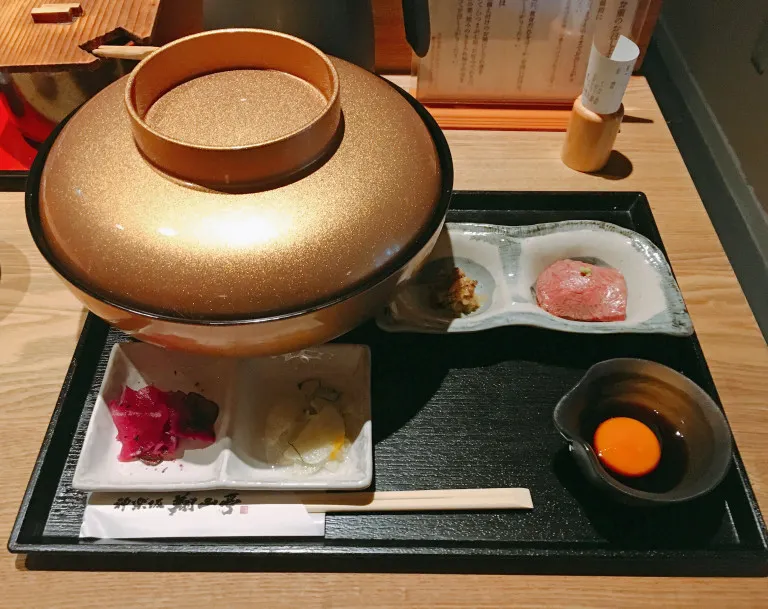

mungkin saat anda di restoran anda memberi uang tip sebagai bentuk apresiasi, tetapi anda tidak perlu melakukan hal tersebut di jepang. kenapa? berikut alasan nya

# Memberi uang tip bukanlah bagian dari budaya jepang

Banyak buku panduan budaya mengklaim bahwa pemberian tip dianggap “kasar” di Jepang, tetapi itu tidak benar-benar terjadi. Sebenarnya, itu hanya terlihat aneh.

Misalnya, bayangkan Anda berada di supermarket membeli bahan makanan. Total belanja anda 95 yen, tetapi Anda memberi petugas kasir 100 yen, dan berkata, “Simpan kembalian nya.”

Petugas itu tidak akan tersinggung, tetapi pasti akan bingung, karena mengapa Anda akan memberi tip kepada kasir supermarket?

# Jepang punya bentuk tipping semu

Di Jepang, Anda tidak perlu membayar lebih dari jumlah pada tagihan Anda. Namun, itu tidak berarti bahwa total Anda sama dengan biaya makanan dan minuman yang Anda pesan.

Di banyak restoran Jepang, setelah Anda duduk, Anda secara otomatis akan mendapat makanan pembuka yang kecil. Namun, ini bukan barang gratis seperti handuk tangan panas atau dingin yang juga dibawa ke meja.

Makanan pembuka, yang disebut otoshi, adalah sesuatu yang harus Anda bayar, terlepas dari apakah Anda menginginkannya atau tidak.

Harga Otoshi biasanya sekitar 500 yen (Rp. 64.265) (1 Yen = 128,53 Rupiah – Informasi Valas BNI 23/08/2018 10:20:00 WIB) per orang,rata-rata otoshi cukup kecil untuk dikonsumsi dalam dua atau tiga gigitan dan biasanya salad sayuran sederhana yang dibuat dengan bahan-bahan murah.

500 yen tentu bukan jumlah yang terlalu besar bukan?.

Sebagian besar restoran santai, seperti ramen, restoran sushi, dan okonomiyaki, tidak memiliki sistem otoshi.

# Restoran Jepang mempunyai jam istirahat yang lama

restoran Jepang umumnya tutup selama sore hari. Sementara cabang makanan cepat saji biasanya dibuka terus-menerus dari pagi hingga malam,

Beberapa restoran izakaya dan kelas atas bahkan tidak buka untuk makan siang sama sekali, melayani secara eksklusif untuk makan malam

tentu mengurangi jumlah jam kerja para pelayan bukan?

# Makanai

salah satu alasan pekerja restoran membutuhkan gaji adalah agar mereka dapat membeli makanan, tidak mendapat tip tentu mereka mempunyai lebih sedikit uang. Tetapi jika Anda bekerja di restoran Jepang, Anda kemungkinan akan mendapatkan setidaknya satu kali makan sehari.

Makanai mengacu pada makanan yang dibuat di dapur restoran dan disediakan untuk staf secara gratis. Tentunya ini tidak akan menjadi menu yang mahal, tetapi makanai masih dibuat dengan bahan-bahan berkualitas restoran. Beberapa restoran makanai begitu lezat sehingga akhirnya dipromosikan menjadi menu untuk para pelanggan restoran.

# Layanan buruk bukan bagian dari budaya Jepang, baik dari bisnis atau perspektif pelanggan

Merasa bangga dengan pekerjaan, tidak peduli betapa rendahnya profesi, sangat tertanam dalam budaya Jepang.

Etika kerja seperti itu adalah bagian dari masyarakat Jepang sehingga jika Anda tidak melakukan nya, kemungkinan besar atasan Anda dapat dengan mudah menemukan orang lain yang melakukannya.

Demikian pula, pelanggan Jepang memiliki standar layanan yang sangat tinggi, tetapi jika mereka tidak terpenuhi, mereka tidak akan pernah kembali ke restoran lagi, bahkan setelah hanya satu pengalaman buruk

Sumber : [SoraNews24](https://soranews24.com/2018/08/23/five-reasons-theres-no-tipping-at-restaurants-in-japan/)
