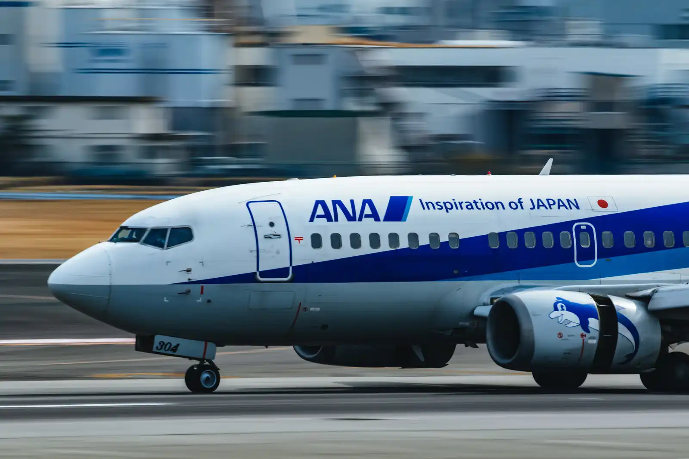
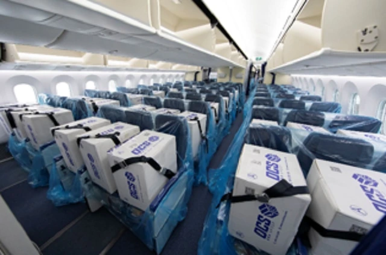

karena COVID-19 tentu memaksa setiap orang berdiam diri di rumah, hal ini membuat setiap hari nya penerbangan tidak ada penumpang.

begitupun dengan salah satu maskapai penerbangan asal Jepang All Nippon Airways (ANA), setiap penerbangan meereka tidak ada orang kecuali kru pesawat

untuk mengatasi hal tersebut ANA memutuskan menaruh kotak yang berisi peralatan medis di setiap kursi penumpang, yang tentu saja membuat kapasitas kargo meningkat sebanyak 40%

<iframe width="560" height="315" src="https://www.youtube-nocookie.com/embed/67rS-APVdSQ" frameborder="0" allow="accelerometer; autoplay; encrypted-media; gyroscope; picture-in-picture" allowfullscreen></iframe>

\[[Sora News 24](https://soranews24.com/2020/04/24/with-no-passengers-japanese-airline-fills-every-seat-on-plane-with-masks-and-medical-supplies/?utm_source=SEKAI.ID&utm_medium=SEKAI.ID_Source_Link&utm_campaign=SEKAI.ID_Source_Link)\]
