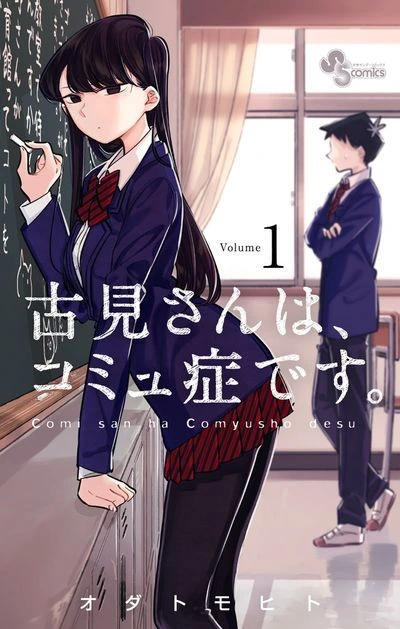
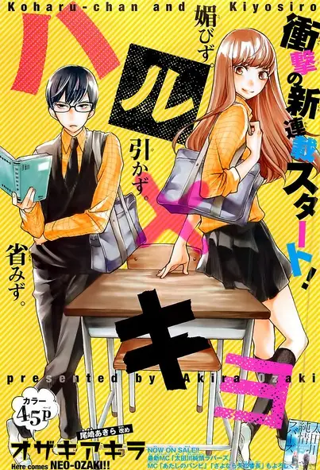
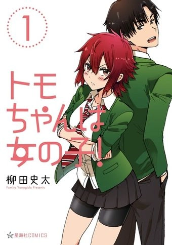
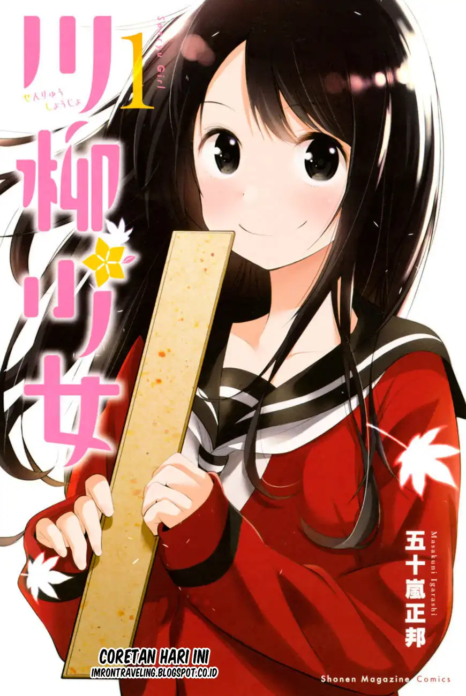

Assalamualaikum para pembaca blog di SEKAI.ID Apa kabar kalian semua ? Pasti baik kan ? Alhamdulillah

kali ini mimin Akemi Homura membagikan “4 Manga Bertemakan Sekolah ini Mempunyai Alur Cerita Yang Menarik, Cocok Untuk kamu Baca Saat Bosan” hanya untuk kamu. iya kamu :v

# Komi-san wa komyushou desu

Komi-san adalah gadis cantik dan mengagumkan yang tak seorang pun bisa melepaskan pandangan kepadanya.

Hampir seluruh sekolah menganggapnya sebagai kecantikan yang dingin, tapi Tadano Hitohito mengetahui yang sebenarnya bahwa dirinya benar-benar buruk dalam berkomunikasi dengan orang lain.

Komi-san, yang ingin memperbaiki kebiasaan buruknya ini, mencoba memperbaikinya dengan bantuan Tadano-kun dengan mencapai tujuannya memiliki 100 teman.

Penulis : ODA Tomohito  
Genre : Romance,Comedy,School life

Catatan: enggak semua cewek cuek itu bisa komunikasi dengan lancar  
Hohoho~

<

Haruxkiyo

Meskipun si koharu lebih tinggi dari pada orang-orang pada umumnya.

Dia adalah cewek umur 15 tahun yang hidup jauh lebih sederhana daripada orang kebanyakan.

Gak punya pengalaman cinta,dia berpikir bahwa dia menjalani hidup nya dengan tentram bersama teman-teman nya(geng)

Namun pertemuan yang ditakdirkan akan mengubah koharu

Genre : Romance,comedy,school life

Penulis : Ozaki akira

Catatan : cinta tidak memandang fisik tetapi cinta memandang hati seperti manga ini dimana yang perempuan lebih tinggi dari pada yang cowok

Tomo chan wa ona noko

Tomo Aizawa sudah berhasil menyatakan perasaan nya kepada cowok yang dia suka bernama junichirou kubota .

Tapi ada satu masalah yaitu si cowok ini hanya menganggap tomo sebagai teman saja

Dia (junichirou kubota) bahkan menganggap tomo itu cowok (ya karena si tomo ini cewek tomboy dari kecil sampai sekarang), sampai akhirnya mereka pergi ke smp yang sama,karena sd mereka dulu berbeda tempat.

Jadi,kisah perjuangan si tomo untuk mendapatkan hati si jun pun akhirnya di mulai.

Genre : Comedy,Romance,School life

Penulis: YANAGIDA Fumita

Catatan: jangan pernah remehin cewek tomboy yang sedang berjuang karena sekali dia dandan secuek-cuek nya kamu pun akan Luluh  
Hohoho~

Senryuu Shoujo

Yukishiro nanako adalah cewek sma yang manis,ceria dengan satu sifat aneh dari pada berbicara layak nya orang biasa,

dia malah menulis dengan menggunakan Sen ryuu (sejenis haiku) puisi untuk menyampaikan pikirannya

Nah bersama dengan anak badung (mantan) si bususima eiji mereka adalah member baru di klub sastra di sekolah

Meskipun si nanako nggak ngomong,tapi dengan kekuatan senryuu pasangan yang manis ini nggak punya masalah untuk menikmati masa sekolah mereka yang menyenangkan

Genre : comedy,school life,slice of life

Penulis : Igarashi Masakuni

Note : terkadang bertemu orang yang mempunyai keunikan tersendiri membuat mu berpikir bahwa orang yang berbeda dengan kita adalah orang yang menarik

Bagaimana menarik bukan?

Khusus manga yang berjudul senryuu shojuo ada rumor kalo bakal diadaptasi sebagai anime di bulan April wah gak sabar ya untuk nonton anime nya

Sekian postingan dari admin Akemi homura disini saya berharap postingan saya bisa membantu kalian yang sedang bosan/sedang mencari rekomendasi manga

Hohoho~
